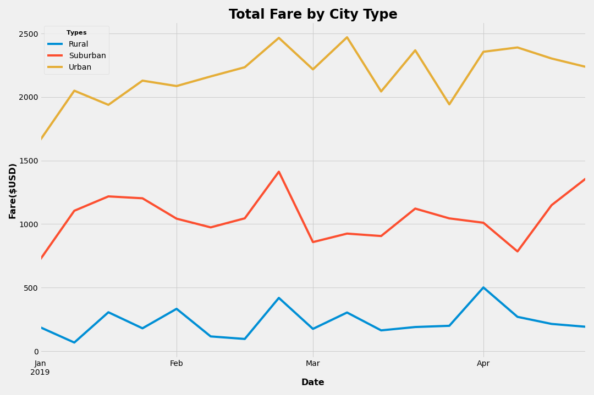

# PyBer_Analysis

## Overview of Analysis
#### This project is an analysis of the PyBer ride share data by location type. It is comparing Urban / Suburban / Rural ride data and weekly fare in early 2019 by city type.  

## Results
#### Below is the end results of the "Total Fare by City Type" which shows the highest activity for Urban areas and the lowest for Rural areas.

## Summary
-	The urban areas had the highest total fares presumably due to the volume of rides but had the lowest average fares. This is presumably because of the shorter distances in urban areas but a larger customer base.
-	In an unexpected twist, the rural areas had the highest average fare most likely due to the longer distance of rides in this area.
-	The analysis was constrained by the lack of information on the average ride per data types which would give us a better insight into things like “average fare per mile driven” and things that would allow us to better compare the three (urban, suburban, rural) areas.
